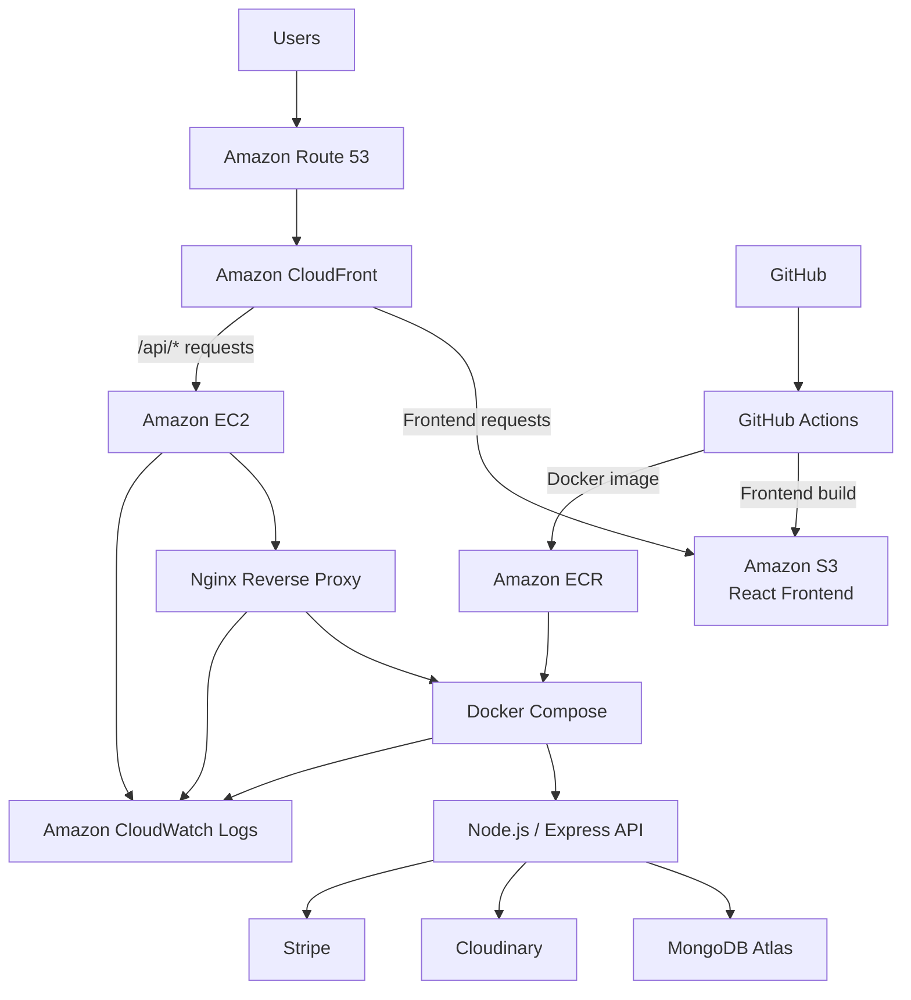

# Full-Stack MERN E-Commerce Platform

A production-style full-stack e-commerce application built with React, Node.js, Express, and MongoDB, deployed on AWS with automated CI/CD, containerized backend infrastructure, centralized logging, monitoring, HTTPS, and a custom domain.

## Live Application

- Storefront: https://adedrius.dev
- API example: https://adedrius.dev/api/product/list
- Source code: https://github.com/Adedrius/ecommerce-app-fullstack

## Overview

This project is a complete e-commerce platform with:

- Customer storefront
- Product browsing
- Product details
- Shopping cart
- User authentication
- Order placement
- Online payment integration
- Admin dashboard
- Product management
- Image upload and storage
- Production deployment on AWS
- Automated frontend and backend deployments

The frontend is hosted as a static React application on Amazon S3 and delivered globally through Amazon CloudFront. API requests are routed through the same CloudFront distribution to an Express backend running in a Docker container on Amazon EC2.

## Features

### Customer Features

- Browse available products
- View product details
- Filter and explore collections
- Select product sizes
- Add items to cart
- Update cart quantities
- Register and log in
- Place orders
- View previous orders
- Complete payments
- Responsive user interface
- Custom 404 page for invalid routes

### Admin Features

- Admin authentication
- Add products
- Upload product images
- Remove products
- View product listings
- Manage orders
- Update order status

## Technology Stack

### Frontend

- React
- Vite
- React Router
- Axios
- Context API
- Tailwind CSS

### Admin Application

- React
- Vite
- Axios
- Tailwind CSS

### Backend

- Node.js
- Express.js
- MongoDB Atlas
- Mongoose
- JSON Web Tokens
- bcrypt
- Multer
- Cloudinary
- Stripe
- CORS
- dotenv

### AWS Infrastructure

- Amazon S3
- Amazon CloudFront
- Amazon EC2
- Amazon ECR
- Amazon Route 53
- AWS Certificate Manager
- Amazon CloudWatch
- AWS IAM

### DevOps and Server Tools

- Docker
- Docker Compose
- GitHub Actions
- Nginx
- Amazon Linux 2023
- SSH
- PM2 during the original deployment phase

## Production Architecture



## Request Flow

### Frontend

```text
User
  ↓
adedrius.dev
  ↓
Route 53
  ↓
CloudFront
  ↓
Amazon S3
  ↓
React application
```

### Backend API

```text
User
  ↓
https://adedrius.dev/api/*
  ↓
CloudFront behavior for /api/*
  ↓
EC2
  ↓
Nginx
  ↓
Docker container
  ↓
Express API
  ↓
MongoDB Atlas / Cloudinary / Stripe
```

## AWS Deployment

### Frontend Hosting

The React frontend is built with Vite and deployed to Amazon S3.

CloudFront provides:

- HTTPS
- CDN delivery
- Custom domain support
- Cache invalidation
- Routing to both frontend and backend origins

The S3 bucket remains private and CloudFront accesses it through origin access control.

### Backend Hosting

The backend runs on an Amazon EC2 instance using:

- Amazon Linux 2023
- Nginx as a reverse proxy
- Docker
- Docker Compose
- A backend image stored in Amazon ECR

The Express application listens on port `4000` inside the container.

Docker publishes the application only to the EC2 loopback interface:

```text
127.0.0.1:4000
```

This allows Nginx to access the backend without exposing port `4000` directly to the internet.

## Docker Architecture

The backend is packaged using a Dockerfile based on Node.js 22.

The image:

- Installs production dependencies with `npm ci --omit=dev`
- Excludes `.env` files and local dependencies
- Runs the Express server on port `4000`
- Runs as the non-root `node` user
- Uses a Docker health check
- Restarts automatically through Docker Compose

Production deployment uses:

```text
GitHub Actions
  ↓
Build Docker image
  ↓
Push image to Amazon ECR
  ↓
EC2 authenticates with ECR
  ↓
Docker Compose pulls latest image
  ↓
Container is recreated
  ↓
Health check verifies deployment
```

## CI/CD Pipelines

### Frontend Deployment Pipeline

The frontend workflow runs when files under `frontend/` change.

It performs:

1. Repository checkout
2. Node.js setup
3. Dependency installation with `npm ci`
4. Vite production build
5. AWS authentication
6. S3 synchronization
7. CloudFront cache invalidation

```text
git push
  ↓
GitHub Actions
  ↓
npm ci
  ↓
npm run build
  ↓
aws s3 sync
  ↓
CloudFront invalidation
```

### Backend Deployment Pipeline

The backend workflow runs when backend files, the Compose configuration, or the workflow itself changes.

It performs:

1. Repository checkout
2. AWS authentication
3. Amazon ECR login
4. Docker image build
5. Image tagging with the commit SHA and `latest`
6. Push to Amazon ECR
7. SSH connection to EC2
8. Source synchronization with GitHub
9. ECR authentication on EC2
10. Docker image pull
11. Docker Compose deployment
12. API health verification
13. Old image cleanup

```text
git push
  ↓
GitHub Actions
  ↓
Docker build
  ↓
Amazon ECR
  ↓
SSH to EC2
  ↓
Docker Compose pull
  ↓
Docker Compose up
  ↓
Health check
```

## Monitoring and Logging

Amazon CloudWatch is used for:

- EC2 CPU metrics
- Memory metrics
- Disk usage metrics
- Nginx access logs
- Nginx error logs
- Backend container logs
- CloudWatch alarms

The backend container uses Docker's native `awslogs` logging driver.

```text
Express stdout/stderr
  ↓
Docker awslogs driver
  ↓
CloudWatch Logs
  ↓
/ecommerce/backend/container
```

CloudWatch log retention is configured to prevent unlimited storage growth.

An alarm was also configured to notify when EC2 resource usage exceeds the selected threshold.

## Domain and HTTPS

The domain was purchased from Namecheap:

```text
adedrius.dev
```

DNS is managed by Amazon Route 53.

The Namecheap nameservers were replaced with Route 53 nameservers.

AWS Certificate Manager provides the TLS certificate for:

```text
adedrius.dev
*.adedrius.dev
```

CloudFront uses the ACM certificate to serve the application securely through HTTPS.

The custom domain routes to the CloudFront distribution using Route 53 alias records.

## CloudFront Routing

The CloudFront distribution uses multiple origins and behaviors.

```text
Default behavior /*
  → Amazon S3 frontend

/api/*
  → EC2 backend
```

The API behavior:

- Allows required HTTP methods
- Disables caching
- Forwards API requests to Nginx on EC2
- Prevents the frontend from calling the EC2 IP directly
- Keeps frontend and backend requests under one HTTPS domain

## Single-Page Application Routing

Because the frontend is a React single-page application, CloudFront custom error responses route unknown S3 paths back to:

```text
/index.html
```

React Router then decides whether to display:

- A valid page
- The custom 404 page

This supports direct navigation to frontend routes such as:

```text
/product/:id
/cart
/orders
/collection
```

## Project Structure

```text
ecommerce-app/
├── .github/
│   └── workflows/
│       ├── deploy-frontend.yml
│       └── deploy-backend.yml
│
├── admin/
│   ├── src/
│   ├── package.json
│   └── .env
│
├── backend/
│   ├── config/
│   ├── controllers/
│   ├── middleware/
│   ├── models/
│   ├── routes/
│   ├── Dockerfile
│   ├── .dockerignore
│   ├── package.json
│   ├── package-lock.json
│   ├── server.js
│   └── .env
│
├── frontend/
│   ├── src/
│   ├── package.json
│   ├── package-lock.json
│   └── .env
│
├── compose.yaml
├── .gitignore
└── README.md
```

## Environment Variables

Environment files are intentionally excluded from Git.

### Backend

Typical backend variables include:

```env
MONGODB_URI=
JWT_SECRET=
ADMIN_EMAIL=
ADMIN_PASSWORD=
CLOUDINARY_NAME=
CLOUDINARY_API_KEY=
CLOUDINARY_SECRET_KEY=
STRIPE_SECRET_KEY=
PORT=4000
```

### Frontend

```env
VITE_BACKEND_URL=
```

### Admin

```env
VITE_BACKEND_URL=
```

The production frontend backend URL is provided during the GitHub Actions build process.

## Local Development

### Clone the Repository

```bash
git clone https://github.com/Adedrius/ecommerce-app-fullstack.git
cd ecommerce-app-fullstack
```

### Run the Backend Normally

```bash
cd backend
npm install
npm start
```

### Run the Frontend

```bash
cd frontend
npm install
npm run dev
```

### Run the Admin Application

```bash
cd admin
npm install
npm run dev
```

## Run the Backend with Docker

Build the image:

```bash
docker build -t ecommerce-backend:local ./backend
```

Run it:

```bash
docker run --rm \
  --name ecommerce-backend-local \
  --env-file ./backend/.env \
  -p 4000:4000 \
  ecommerce-backend:local
```

Using Docker Compose:

```bash
docker compose up --build
```

Stop the services:

```bash
docker compose down
```

## Security Measures

The deployment includes:

- Private S3 bucket
- CloudFront origin access control
- HTTPS through AWS Certificate Manager
- IAM roles for EC2
- Restricted EC2 security group rules
- Backend port bound to `127.0.0.1`
- Secrets excluded from Git
- GitHub repository secrets and variables
- ECR permissions for image push and pull
- Docker container running as a non-root user
- CloudWatch monitoring and alerts
- Nginx reverse proxy
- API traffic routed through CloudFront

## Challenges Solved

During development and deployment, several infrastructure issues were diagnosed and resolved:

- CloudFront access to a private S3 bucket
- S3 bucket policy configuration
- EC2 SSH connectivity
- EC2 security group access
- Node.js runtime incompatibility
- MongoDB crypto support on older Node.js versions
- Nginx `502 Bad Gateway`
- PM2 process configuration
- Frontend environment variables during Vite builds
- Git submodule issues
- Vite and React plugin dependency conflicts
- GitHub Actions dependency caching
- Automated S3 deployment
- Automated EC2 deployment
- Docker environment file formatting
- Docker Compose installation on Amazon Linux
- Amazon ECR authentication
- Safe migration from PM2 to Docker
- CloudWatch container logging
- Route 53 nameserver delegation
- ACM DNS validation
- CloudFront custom domain configuration
- React SPA routing and custom 404 handling

## Lessons Learned

This project provided hands-on experience with:

- Designing a full-stack cloud architecture
- Hosting static applications on S3
- Delivering content through CloudFront
- Configuring multiple CloudFront origins and behaviors
- Running production Node.js applications on EC2
- Configuring Nginx as a reverse proxy
- Managing Linux services
- Automating frontend deployments
- Automating backend deployments
- Containerizing Node.js applications
- Using Amazon ECR as a private registry
- Deploying containers with Docker Compose
- Managing DNS through Route 53
- Configuring TLS certificates with ACM
- Monitoring applications with CloudWatch
- Troubleshooting CI/CD pipelines
- Managing environment variables securely
- Performing safe production migrations

## Future Improvements

Possible future enhancements include:

- GitHub OIDC instead of long-lived AWS access keys
- Least-privilege IAM policies
- AWS WAF rate limiting
- AWS Secrets Manager or Parameter Store
- Automatic rollback to the previous Docker image
- ECR lifecycle policies
- Public uptime monitoring
- Dependabot
- Branch protection rules
- Automated tests in CI
- Terraform or AWS CDK
- Migration from EC2 Compose to Amazon ECS Fargate
- Redis caching
- Search indexing
- Email notifications
- Custom domain email such as `contact@adedrius.dev`

## Author

**Adedrius**

- GitHub: https://github.com/Adedrius
- Live project: https://adedrius.dev